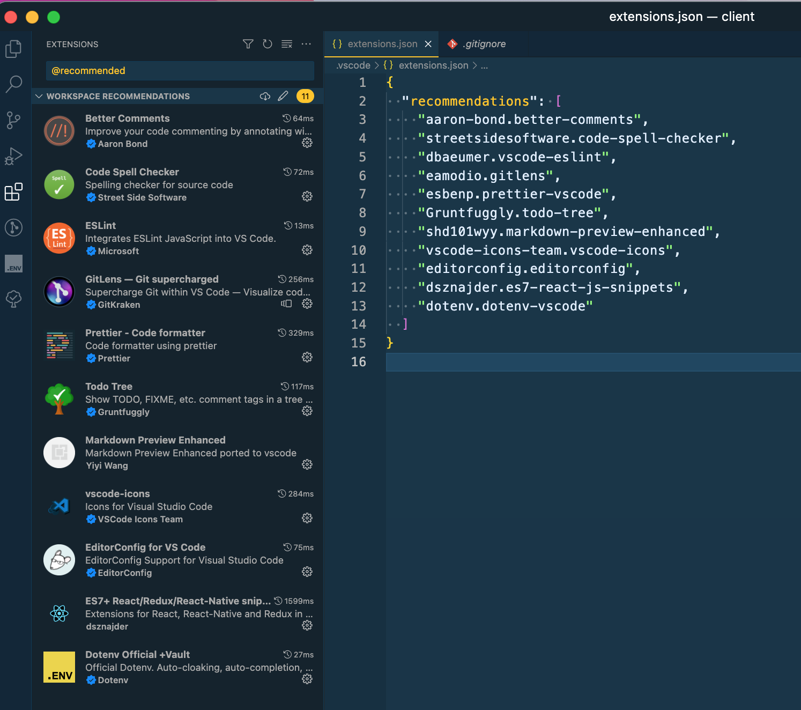

# LAVDEV SHOP

## Clone project

```sh
git clone https://github.com/leanhvu21042001/lavdev-shop.git
```

## Install dependencies and DevDependencies

- Download [NVM](https://github.com/nvm-sh/nvm)
- Run file `./nvm-setup.sh`

```sh
yarn
```

## Scripts

- Build: `yarn build`
<!-- - Start build: `yarn start` -->
- Start Development: `yarn start`

## Rules commit

- Prevent commit at branch dev and branch main
- Prevent push at branch main
- [Conventional commits](https://github.com/conventional-changelog/commitlint/tree/master/%40commitlint/config-conventional)

## JavaScript Style

- [Eslint](https://eslint.org/)

## VSCODE

- Install extensions for project
  
